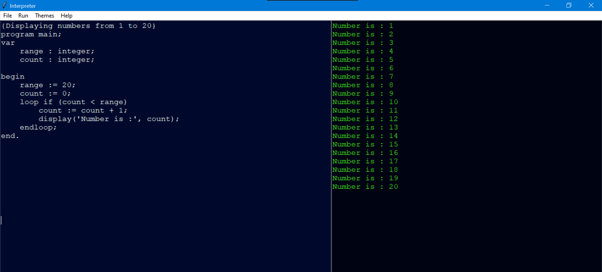

# Interpreter
A simple interpreter and IDE built using python

<h3>Integrated Development Environment</h3>

IDE is built using Python's GUI Tkinter

</img>

You can visit the documentation site for the current programming language by clicking on help in the ide and then selecting Document

<a href="https://githubsumanth.github.io/Pascal-Documentation/">Click here to visit the documentation page</a>

<h3>Grammar</h3>

program : PROGRAM variable SEMI block DOT

block : declarations compound_statement

declarations : VAR (variable_declaration SEMI)+
             | empty

variable_declaration : ID (COMMA ID)* COLON type_spec

type_spec : INTEGER | REAL | BOOLEAN | STRING

compound_statement : BEGIN statement_list END

statement_list : statement
               | statement SEMI statement_list

statement : compound_statement
          | assignment_statement
          | if_statement
          | loop_statement
          | break
          | continue
          | empty

assignment_statement : variable ASSIGN expr

if_statement : IF expr THEN statement_list (ELSEIF expr THEN statement_list)* (ELSE statement_list)? ENDIF

loop_statement : LOOP IF expr statement_list (ELSE statement_list)? ENDLOOP

break : BREAK

continue : CONTINUE

empty :

expr : level_1 (OR level_1)*

level_1 : level_2 (AND level_2)*

level_2 : level_3 ((E|NE|GT|LT|GTE|LTE) level_3)*

level_3 : level_4 ((PLUS|MINUS) level_4)*

level_4 : level_5 ((MUL|FLOAT_DIV|INTEGER_DIV) level_5)*

level_5 : level_6 (DOLLAR level_6)*

level_6 : PLUS level_6
       | MINUS level_6
       | INTEGER_CONST
       | REAL_CONST
       | BOOLEAN
       | STRING
       | LPAREN expr RPAREN
       | variable

variable: ID

<h3>Code Examples</h3>

<pre><code>program helloWorld;
var 
    greeting : string;
    
begin
    greeting := 'Hello World';
    display(greeting);
end.
</code></pre>

<pre><code>{Displaying numbers from 1 to 20}
program main;
var 
	range : integer;
	count : integer;

begin
	range := 20;
	count := 0;
	loop if (count < range)
		count := count + 1;
		display('Number is :', count);
	endloop;
end.
</code></pre>

<pre><code>program continueStatement;
var
	a : integer;

begin 
	a := 0;
	loop if (a < 5)
		a := a + 1;
		if a = 4 then
			continue;
		elseif a = 2 then
			continue;
		endif;
		display('current value of a:', a);
	endloop;
end.
</code></pre>

<pre><code>program breakStatement;
var
	a : integer;

begin 
	a := 0;
	loop if (a < 5)
		a := a + 1;
		if a = 3 then
			break;
		endif;
		display('current value of a:', a);
	endloop;
	display('hurray');
end.
</code></pre>

<pre><code>{Factorial}
program factorial;
var 
	counter, fact : integer;

begin
	counter := 1;
	fact := 1;
	loop if (counter < 10)
		fact := fact * counter;
		counter := counter + 1;
	endloop;
	display('factorial of 10 :',fact);
end.
</code></pre>

<h3>Referrences</h3>
<a href="https://ruslanspivak.com/lsbasi-part1/">Ruslan's Blog: Let’s Build A Simple Interpreter</a>
